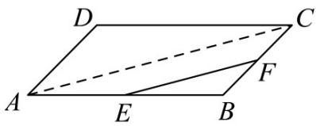

> [!faq]- 《专题03 平面向量》真题解析
>
> > [!success]- **【答案】** A
>
> > [!note]- **【分析】**
> > 【分析】利用向量的线性运算，即可得到答案；
>
> > [!note]- **【解析】**
> > 【详解】连结 $AC$ ，则 $AC$ 为 $\triangle ABC$ 的中位线，
> > $\therefore \overrightarrow{EF} = \frac{1}{2}\overrightarrow{AC} = \frac{1}{2}\overrightarrow{a} +\frac{1}{2}\overrightarrow{b},$
> > 
> >
> > 故选 **A**
