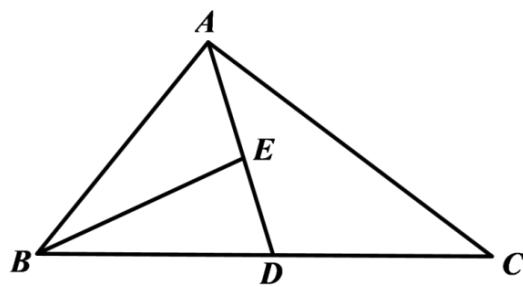

> [!faq]- 《专题03 平面向量》真题解析
>
> > [!success]- **【答案】** A
>
> > [!note]- **【分析】**
> > 分析：首先将图画出来，接着应用三角形中线向量的特征，求得 $\frac{BE}{2}=\frac{1}{2}BA+\frac{1}{2}BD$ ，之后应用向量的加法运算法则……三角形法则，得到 $BC=\frac{BA}{AC}$ ，之后将其合并，得到 $\frac{BE}{4}=\frac{3}{4}BA+\frac{1}{4}AC$ ，下一步应用相反向量，求得 $\frac{EB}{4}=\frac{3}{4}AB-\frac{1}{4}AC$ ，从而求得结果。
>
> > [!note]- **【解析】**
> > 根据向量的运算法则，可得
> > 
> > $$
> > \frac {\square \square \square}{B E} = \frac {1}{2} \frac {\square \square \square}{B A} + \frac {1}{2} \frac {\square \square \square}{B D} = \frac {1}{2} \frac {\square \square \square}{B A} + \frac {1}{4} \frac {\square \square \square}{B C} = \frac {1}{2} \frac {\square \square \square}{B A} + \frac {1}{4} \left(\frac {\square \square \square}{B A} + \frac {\square \square \square}{A C}\right)
> > $$
> > $$
> > = \frac {1}{2} B A + \frac {1}{4} B A + \frac {1}{4} A C = \frac {3}{4} B A + \frac {1}{4} A C
> > $$
> > 所以 $\overline{EB}=\frac{3}{4}\overline{AB}-\frac{1}{4}\overline{AC}$ ，故选 A.
> > 【点睛】该题考查的是有关平面向量基本定理的有关问题，涉及到的知识点有三角形的中线向量、向量加法的三角形法则、共线向量的表示以及相反向量的问题，在解题的过程中，需要认真对待每一步运算·
