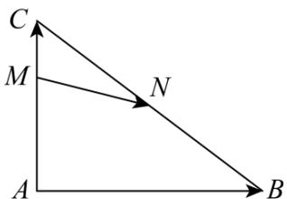

> [!faq]- 《专题03 平面向量》真题解析
>
> > [!success]- **【答案】** 详见解析
>
> > [!note]- **【分析】**
> > 本题未单列分析。
>
> > [!note]- **【解析】**
> > 【答案】 $\frac{1}{2} -\frac{1}{6}$
> > 【详解】特殊化，不妨设 \(AC \perp AB, AB = 4, AC = 3\)，利用坐标法，以 \(A\) 为原点，\(AB\) 为 \(x\) 轴，\(AC\) 为 \(y\) 轴，建立直角坐标系，\(A(0,0), M(0,2), C(0,3), B(4,0), N(2, \(\frac{3}{2}\))，\(MN = (2, -\frac{1}{2}), AB = (4,0), AC = (0,3)\)，则 \((2, -\frac{1}{2}) = x(4,0) + y(0,3)\)，\(4x = 2, 3y = -\frac{1}{2}, \therefore x = \frac{1}{2}, y = -\frac{1}{6}\).
> > 
> > 考点：本题考点为平面向量有关知识与计算，利用向量相等解题·
