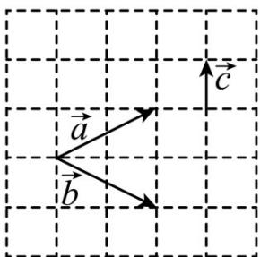

<!-- question-source:start -->
9. (2021·北京·高考真题) 已知向量 $a, b, c$ 在正方形网格中的位置如图所示。若网格纸上小正方形的边长为 1，则

$(a+b)\cdot c=$ \_\_\_\_ ; $a\cdot b=$ \_\_\_\_.

<!-- question-source:end -->

![[高中/真题/按题型分类/专题03 平面向量/考点05_求平面向量数量积/真题/answers/Q00033791A1.md]]
