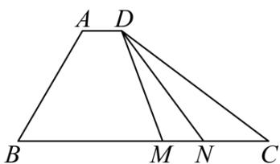

<!-- question-source:start -->
10．（2020·天津·高考真题）如图，在四边形ABCD中， $\angle B=60^{\circ}$ ，AB=3，BC=6，且 $AD=\lambda BC,AD\cdot AB=-\frac{3}{2}$ ，则实数 $\lambda$ 的值为\_\_\_\_，若M,N是线段BC上的动点，且 $|MN|=1$ ，则

$DM \cdot DN$ 的最小值为\_\_\_\_.

<!-- question-source:end -->

![[高中/真题/按题型分类/专题03 平面向量/考点05_求平面向量数量积/真题/answers/Q00033792A1.md]]
