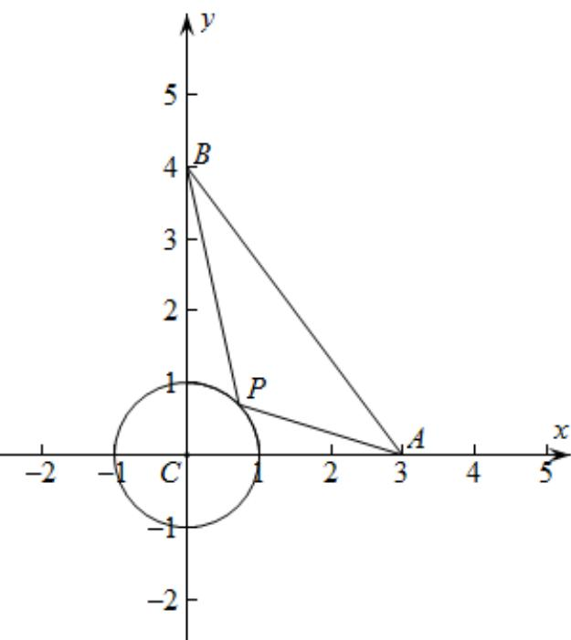

> [!faq]- 《专题03 平面向量》真题解析
>
> > [!success]- **【答案】** D
>
> > [!note]- **【分析】**
> > 【分析】依题意建立平面直角坐标系，设 $P(\cos \theta, \sin \theta)$ ，表示出 $PA$ ， $PB$ ，根据数量积的坐标表示、辅助角公式及正弦函数的性质计算可得；
>
> > [!note]- **【解析】**
> > 【详解】解：依题意如图建立平面直角坐标系，则 $C(0,0)$ ， $A(3,0)$ ， $B(0,4)$
> > 
> > 因为 $PC = 1$ ，所以 $P$ 在以 $C$ 为圆心，1为半径的圆上运动，
> > 设 $P(\cos \theta, \sin \theta)$ ， $\theta \in [0, 2\pi]$
> > 所以 $\stackrel{\square\square}{PA}=\left(3-\cos\theta,-\sin\theta\right)$ ， $\stackrel{\square\square\square}{PB}=\left(-\cos\theta,4-\sin\theta\right)$
> > 所以 $PA \cdot PB = (-\cos \theta) \times (3 - \cos \theta) + (4 - \sin \theta) \times (-\sin \theta)$
> > $$
> > = \cos^ {2} \theta - 3 \cos \theta - 4 \sin \theta + \sin^ {2} \theta
> > $$
> > $$
> > = 1 - 3 \cos \theta - 4 \sin \theta
> > $$
> > $= 1 - 5\sin (\theta +\varphi)$ ，其中 $\sin \varphi = \frac{3}{5}$ ， $\cos \varphi = \frac{4}{5}$
> > 因为 $-1 \leq \sin(\theta + \varphi) \leq 1$ ，所以 $-4 \leq 1 - 5 \sin(\theta + \varphi) \leq 6$ ，即 $PA \cdot PB \in [-4, 6]$ ;
> >
> > 故选 **D**
