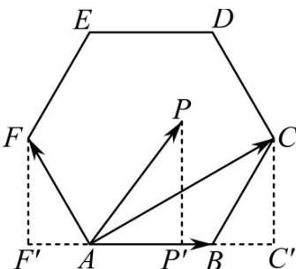

> [!faq]- 《专题03 平面向量》真题解析
>
> > [!success]- **【答案】** A
>
> > [!note]- **【分析】**
> > 【分析】首先根据题中所给的条件，结合正六边形的特征，得到 $AP$ 在 $AB$ 方向上的投影的取值范围是 $(-1,3)$ ，利用向量数量积的定义式，求得结果·
> >
> > 
>
> > [!note]- **【解析】**
> > 【详解】
> > $AB$ 的模为 $^2$ ，根据正六边形的特征，
> > 可以得到 $AP$ 在 $AB$ 方向上的投影的取值范围是 $(-1,3)$
> > 结合向量数量积的定义式，
> > 可知 $AP \cdot AB$ 等于 AB 的模与 AP 在 AB 方向上的投影的乘积，
> > 所以 $AP \cdot AB$ 的取值范围是 $(-2,6)$ ，
> > 故选：A.
> > 【点睛】该题以正六边形为载体，考查有关平面向量数量积的取值范围，涉及到的知识点有向量数量积的定义式，属于简单题目·
> > ## 二、多选题
