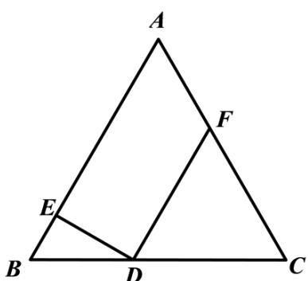

> [!faq]- 《专题03 平面向量》真题解析
>
> > [!success]- **【答案】** $1\frac{11}{20}$
>
> > [!note]- **【分析】**
> > 设 $BE = x$ ，由 $(2BE + DF)^{2} = 4BE^{2} + 4BE\cdot DF + DF^{2}$ 可求出；将 $(DE + DF)\cdot DA$ 化为关于 $x$ 的关系式即可求出最值·
>
> > [!note]- **【解析】**
> > 设 $BE = x$ ， $x\in \left(0,\frac{1}{2}\right)$ ， $\triangle ABC$ 为边长为 $^1$ 的等边三角形， $DE\perp AB$
> > $$
> > \therefore \angle B D E = 3 0 ^ {\circ}, B D = 2 x, D E = \sqrt {3} x, D C = 1 - 2 x
> > $$
> > ∵ $DF \parallel AB$ ，∴ $\triangle DFC$ 为边长为 1-2x 的等边三角形， $DE \perp DF$
> > $$
> > \therefore (2 B E + D F) ^ {2} = 4 B E ^ {2} + 4 B E \cdot D F + D F ^ {2} = 4 x ^ {2} + 4 x (1 - 2 x) \times \cos 0 ^ {\circ} + (1 - 2 x) ^ {2} = 1
> > $$
> > $$
> > \therefore | 2 B E + D F | = 1
> > $$
> > $$
> > \because (D E + D F) \cdot D A = (D E + D F) \cdot (D E + E A) = D E ^ {2} + D F \cdot E A
> > $$
> > $$
> > = (\sqrt {3} x) ^ {2} + (1 - 2 x) \times (1 - x) = 5 x ^ {2} - 3 x + 1 = 5 \left(x - \frac {3}{1 0}\right) ^ {2} + \frac {1 1}{2 0}
> > $$
> > 所以当 $x=\frac{3}{10}$ 时， $(DE+DF)\cdot\frac{UU}{DA}$ 的最小值为 $\frac{11}{20}\cdot$
> > 故答案为： $^{1}$ ； $\frac{11}{20}$
> > 
