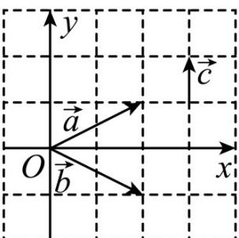

> [!faq]- 《专题03 平面向量》真题解析
>
> > [!success]- **【答案】** 0 3
>
> > [!note]- **【分析】**
> > 根据坐标求出 $a+b$ ，再根据数量积的坐标运算直接计算即可·
>
> > [!note]- **【解析】**
> > 以 $a, b$ 交点为坐标原点，建立直角坐标系如图所示：
> > 
> > 则 $a = (2,1), b = (2, -1), c = (0,1)$
> > $\therefore a + b = (4,0)\quad \therefore (a + b)\cdot c = 4\times 0 + 0\times 1 = 0$
> > $$
> > \therefore a \cdot b = 2 \times 2 + 1 \times (- 1) = 3
> > $$
> > 故答案为：0；3.
