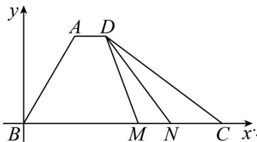

> [!faq]- 《专题03 平面向量》真题解析
>
> > [!success]- **【答案】** $\frac{1}{6}$ $\frac{13}{2}$
>
> > [!note]- **【分析】**
> > 可得 $\angle BAD = 120^{\circ}$ ，利用平面向量数量积的定义求得 $\lambda$ 的值，然后以点 $B$ 为坐标原点， $BC$ 所在直线为 $x$ 轴建立平面直角坐标系，设点 $M(x,0)$ ，则点 $N(x + 1,0)$ （其中 $0 \leq x \leq 5$ ），得出 $\overline{DM} \cdot \overline{DN}$ 关于 $x$ 的函数表达式，利用二次函数的基本性质求得 $\overline{DM} \cdot \overline{DN}$ 的最小值。
>
> > [!note]- **【解析】**
> > ∵ $AD = \lambda BC$ ，∴ $AD \parallel BC$ ，∴ $\angle BAD = 180^{\circ} - \angle B = 120^{\circ}$
> > $$
> > \stackrel {\square \sqcup \sqcup} {A B} \cdot \stackrel {\square \sqcup \sqcup} {A D} = \lambda \stackrel {\square \sqcup \sqcup} {B C} \cdot \stackrel {\square \sqcup \sqcup} {A B} = \lambda | \stackrel {\square \sqcup \sqcup} {B C} | \cdot | \stackrel {\square \sqcup \sqcup} {A B} | \cos 1 2 0 ^ {\circ}
> > $$
> > $= \lambda \times 6 \times 3 \times \left(-\frac{1}{2}\right) = -9\lambda = -\frac{3}{2}$
> > 解得 $\lambda=\frac{1}{6}$
> > 以点 $B$ 为坐标原点， $BC$ 所在直线为 $x$ 轴建立如下图所示的平面直角坐标系 $xBy$
> > 
> > $$
> > B C = 6, \therefore C (6, 0)
> > $$
> > $\because\left|AB\right|=3,\angle ABC=60^{\circ},\therefore$ 的坐标为 $A\left(\frac{3}{2},\frac{3\sqrt{3}}{2}\right)$
> > ∵又∵ $AD=\frac{1}{6}BC$ ，则 $D\left(\frac{5}{2},\frac{3\sqrt{3}}{2}\right)$ ，设 $M(x,0)$ ，则 $N(x+1,0)$ （其中 $0\leq x\leq5$ ），
> > $\overrightarrow{DM} = \left(x - \frac{5}{2}, -\frac{3\sqrt{3}}{2}\right), \overrightarrow{DN} = \left(x - \frac{3}{2}, -\frac{3\sqrt{3}}{2}\right)$
> > $$
> > D M \cdot D N = \left(x - \frac {5}{2}\right) \left(x - \frac {3}{2}\right) + \left(\frac {3 \sqrt {3}}{2}\right) ^ {2} = x ^ {2} - 4 x + \frac {2 1}{2} = (x - 2) ^ {2} + \frac {1 3}{2},
> > $$
> > 所以，当 $x = 2$ 时， $\frac{DM}{DM} \cdot \frac{DN}{DN}$ 取得最小值 $\frac{13}{2}$ .
> > 故答案为： $\frac{1}{6}$ ; $\frac{13}{2}$ .
> > 【点睛】本题考查平面向量数量积的计算，考查平面向量数量积的定义与坐标运算，考查计算能力，属于中等题·
