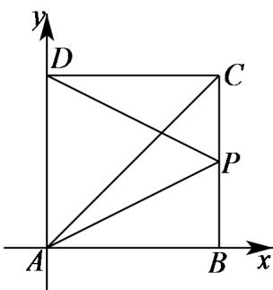

> [!faq]- 《专题03 平面向量》真题解析
>
> > [!success]- **【答案】** 详见解析
>
> > [!note]- **【分析】**
> > 【分析】以点A为坐标原点，AB、AD所在直线分别为x、y轴建立平面直角坐标系，求得点P的坐标，利用平面向量数量积的坐标运算可求得 $\left|PD\right|$ 以及 $PB\cdot PD$ 的值.
>
> > [!note]- **【解析】**
> > 【详解】以点 A 为坐标原点，AB、AD 所在直线分别为 x、y 轴建立如下图所示的平面直角坐标系，
> > 
> > 则点 $A(0,0)$ 、 $B(2,0)$ 、 $C(2,2)$ 、 $D(0,2)$ ，
> > $$
> > \stackrel {\square \square \square} {A P} = \frac {1}{2} \left(\stackrel {\square \square \square} {A B} + \stackrel {\square \square \square} {A C}\right) = \frac {1}{2} (2, 0) + \frac {1}{2} (2, 2) = (2, 1)
> > $$
> > 则点 $P(2,1)$ ，∴ $PD = (-2,1)$ ， $PB = (0,-1)$ ，
> > 因此， $\left|PD\right|=\sqrt{(-2)^{2}+1^{2}}=\sqrt{5}$ ， $PB\cdot PD=0\times(-2)+1\times(-1)=-1\cdot$
> > 故答案为： $\sqrt{5}$ ；-1
> > 【点睛】本题考查平面向量的模和数量积的计算，建立平面直角坐标系，求出点 $P$ 的坐标是解答的关键，考查计算能力，属于基础题·
