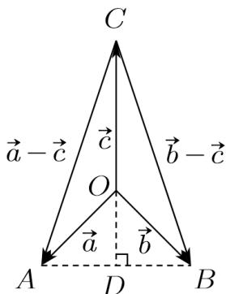

> [!faq]- 《专题03 平面向量》真题解析
>
> > [!success]- **【答案】** D
>
> > [!note]- **【分析】**
> > 【分析】作出图形,根据几何意义求解.
>
> > [!note]- **【解析】**
> > 【详解】因为 $a + b + c = 0$ ，所以 $\stackrel{r}{a} + \stackrel{i}{b} = -\stackrel{r}{c}$
> > 即 $a^2 + b^2 + 2a \cdot b = c^2$ ，即 $1 + 1 + 2a^r \cdot b = 2$ ，所以 $a \cdot b = 0$ 。
> > 如图,设 $OA = a, OB = b, OC = c$ ,
> > 
> > 由题知,OA=OB=1,OC= $\sqrt{2}$ , $\triangle OAB$ 是等腰直角三角形,
> > AB 边上的高 $OD = \frac{\sqrt{2}}{2}$ , $AD = \frac{\sqrt{2}}{2}$ ,
> > 所以 $CD = CO + OD = \sqrt{2} + \frac{\sqrt{2}}{2} = \frac{3\sqrt{2}}{2}$ ,
> > $$
> > \text {an} \angle A C D = \frac {A D}{C D} = \frac {1}{3}, \cos \angle A C D = \frac {3}{\sqrt {1 0}}
> > $$
> > $\cos \langle a - c, b - c \rangle = \cos \angle ACB = \cos 2\angle ACD = 2\cos^2 \angle ACD - 1$ $= 2 \times \left( \frac{3}{\sqrt{10}} \right)^2 - 1 = \frac{4}{5}$ .
> >
> > 故选 **D**.
