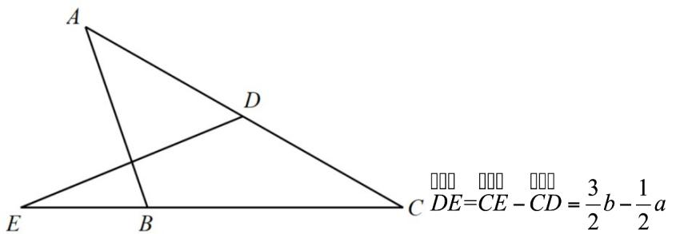
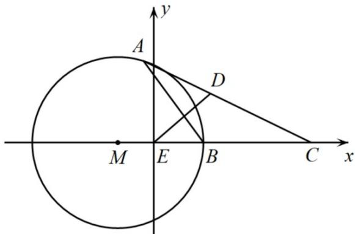

> [!faq]- 《专题03 平面向量》真题解析
>
> > [!success]- **【答案】** 详见解析
>
> > [!note]- **【分析】**
> > 【分析】法一：根据向量的减法以及向量的数乘即可表示出 $\overline{DE}$ ，以 $\left\{a,b\right\}$ 为基底，表示出 $\overline{AB},\overline{DE}$ ，由 $AB\perp DE$ 可得 $3b^{2}+a^{2}=4b\cdot a$ ，再根据向量夹角公式以及基本不等式即可求出。
> >
> > 法二：以点 E 为原点建立平面直角坐标系，设 $E(0,0)$ , $B(1,0)$ , $C(3,0)$ , $A(x,y)$ ，由 $AB \perp DE$ 可得点 A 的轨迹为以 $M(-1,0)$ 为圆心，以 r = 2 为半径的圆，方程为 $(x + 1)^{2} + y^{2} = 4$ ，即可根据几何性质可知，当且仅当 CA 与 $\odot M$ 相切时， $\angle C$ 最大，即求出。
>
> > [!note]- **【解析】**
> > 【详解】方法一：
> > 
> > $$
> > A B = C B - C A = b - a, A B \perp D E \Rightarrow (3 b - a) \cdot (b - a) = 0
> > $$
> > $\Rightarrow\cos\angle ACB=\frac{a\cdot b}{\left|a\right|\left|b\right|}=\frac{3b^{2}+a^{2}}{4\left|a\right|\left|b\right|}\quad\frac{2\sqrt{3}\left|a\right|\left|b\right|}{4\left|a\right|\left|b\right|}=\frac{\sqrt{3}}{2}$ ，当且仅当 $\left|a\right|=\sqrt{3}\left|b\right|$ 时取等号，而
> > $0 < \angle ACB < \pi$ ，所以 $\angle ACB \in (0, \frac{\pi}{6}]$
> > 故答案为： $\frac{3}{2}b-\frac{1}{2}a;\frac{\pi}{6}$
> > 方法二：如图所示，建立坐标系：
> > 
> > $$
> > E (0, 0), B (1, 0), C (3, 0), A (x, y)
> > $$
> > $DE = (-\frac{x + 3}{2}, -\frac{y}{2}), AB = (1 - x, -y)$
> > $\overrightarrow{DE} \perp \overrightarrow{AB} \Rightarrow (\frac{x+3}{2})(x-1) + \frac{y^{2}}{2} = 0 \Rightarrow (x+1)^{2} + y^{2} = 4$ ，所以点 $A$ 的轨迹是以 $M(-1,0)$ 为圆心，以 $r = 2$ 为半径的圆，当且仅当 $CA$ 与 $\odot M$ 相切时， $\angle C$ 最大，此时 $\sin C = \frac{r}{CM} = \frac{2}{4} = \frac{1}{2}, \angle C = \frac{\pi}{6}$ .
> > 故答案为： $\frac{3}{2}b-\frac{1}{2}a$ ； $\frac{\pi}{6}$
