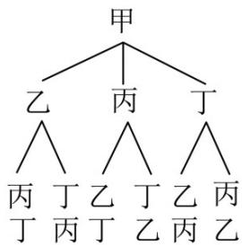
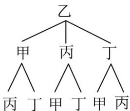
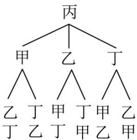
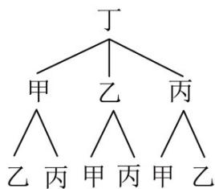
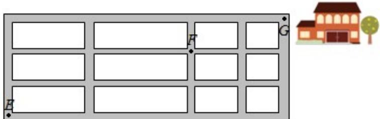

<!-- source-part:1 pages:1-15 -->

# 十年真题 2015-2024

# 专题05 排列组合与二项式定理

## 十年考情·探规律

<table><tr><td>考点</td><td>十年考情(2015-2024)</td><td>命题趋势</td></tr><tr><td>考点1 排列组合综合(10年8考)</td><td>2024·全国甲卷、2023·全国甲卷、2023·全国甲卷、2023·全国乙卷、2023·全国新II卷、2022·全国新II卷、2022·全国新I卷、2021·全国乙卷、2021·全国甲卷、2021·全国甲卷、2020·海南卷、2020·山东卷、2019·全国卷、2017·全国卷、2016·全国卷、2016·四川卷、2016·全国卷</td><td rowspan="2">1. 理解、掌握排列与组合的定义,会计算排列数与组合数,熟练掌握排列组合的解题方法排列组合是新高考卷的常考内容,一般会和分类加法原理与分步乘法原理结合在小题中考查,需重点复习2. 理解、掌握二项式定理的通项公式,会相关基本量的求解,会三项式、乘积式的相关计算二项式定理是新高考卷的常考内容,一般考查二项式系数和、系数和、求给定项的二项式系数或系数及相关最大(小)项计算,需重点强化复习</td></tr><tr><td>考点2 二项式定理综合(10年8考)</td><td>2024·北京卷、2022·北京卷、2020·北京卷、2020·全国卷、2019·全国卷、2018·全国卷、2017·全国卷、2017·全国卷、2016·四川卷、2015·全国卷、2015·陕西卷、2015·湖南卷、2015·湖北卷</td></tr></table>

## 分考点·精准练

1. (2024·全国甲卷·高考真题) 甲、乙、丙、丁四人排成一列, 则丙不在排头, 且甲或乙在排尾的概率是 ( )
A. $\frac{1}{4}$ B. $\frac{1}{3}$ C. $\frac{1}{2}$ D. $\frac{2}{3}$

【答案】B

【分析】解法一：画出树状图，结合古典概型概率公式即可求解·

解法二：分类讨论甲乙的位置，结合得到符合条件的情况，然后根据古典概型计算公式进行求解。【详解】解法一：画出树状图，如图，

丁丙丁甲丙甲

丙乙丙甲乙甲

由树状图可得，甲、乙、丙、丁四人排成一列，共有 $^{24}$ 种排法，

其中丙不在排头，且甲或乙在排尾的排法共有 $^{8}$ 种，

故所求概率 $P=\frac{8}{24}=\frac{1}{3}$ .

解法二：当甲排在排尾，乙排第一位，丙有2种排法，丁就1种，共2种；

当甲排在排尾，乙排第二位或第三位，丙有1种排法，丁就1种，共2种；

于是甲排在排尾共4种方法，同理乙排在排尾共4种方法，于是共8种排法符合题意；

基本事件总数显然是 $\mathrm{A}_4^4 = 24$

根据古典概型的计算公式，丙不在排头，甲或乙在排尾的概率为 $\frac{8}{24} = \frac{1}{3}$ .

故选：B

2.（2023·全国甲卷·高考真题）现有 $^{5}$ 名志愿者报名参加公益活动，在某一星期的星期六、星期日两天，每天从这 $^{5}$ 人中安排 $^{2}$ 人参加公益活动，则恰有 $^{1}$ 人在这两天都参加的不同安排方式共有（）
A. 120 B. 60 C. 30 D. 20

【答案】B

【分析】利用分类加法原理，分类讨论五名志愿者连续参加两天公益活动的情况，即可得解

【详解】不妨记五名志愿者为 $a, b, c, d, e$ ，

假设 $a$ 连续参加了两天公益活动，再从剩余的 $^{4}$ 人抽取 $^{2}$ 人各参加星期六与星期天的公益活动，共有 $\mathrm{A}_{4}^{2}=12$ 种方法，

同理： $b, c, d, e$ 连续参加了两天公益活动，也各有12种方法，

所以恰有 $^{1}$ 人连续参加了两天公益活动的选择种数有 $5 \times 12 = 60$ 种

故选：B.

3. (2023·全国甲卷·高考真题) 某校文艺部有 $^{4}$ 名学生, 其中高一、高二年级各 $^{2}$ 名. 从这 $^{4}$ 名学生中随机选 $^{2}$ 名组织校文艺汇演, 则这 $^{2}$ 名学生来自不同年级的概率为 ( )

A. $\frac{1}{6}$ B. $\frac{1}{3}$ C. $\frac{1}{2}$ D. $\frac{2}{3}$

【答案】D

【分析】利用古典概率的概率公式，结合组合的知识即可得解
【详解】依题意，从这 $^{4}$ 名学生中随机选 $^{2}$ 名组织校文艺汇演，总的基本事件有 $C_{4}^{2}=6$ 件，
其中这 $^{2}$ 名学生来自不同年级的基本事件有 $C_{2}^{1}C_{2}^{1}=4$ 所以这 $^{2}$ 名学生来自不同年级的概率为 $\frac{4}{6}=\frac{2}{3}$ .
故选：D.

4. (2023·全国乙卷·高考真题) 甲乙两位同学从 $^{6}$ 种课外读物中各自选读 $^{2}$ 种，则这两人选读的课外读物中恰有 $^{1}$ 种相同的选法共有（）

A.30种 B.60种 C.120种 D.240种

【答案】C

【分析】相同读物有 $^{6}$ 种情况，剩余两种读物的选择再进行排列，最后根据分步乘法公式即可得到答案。
【详解】首先确定相同得读物，共有 $C_{6}^{1}$ 种情况，
然后两人各自的另外一种读物相当于在剩余的 $^{5}$ 种读物里，选出两种进行排列，共有 $A_{5}^{2}$ 种，
根据分步乘法公式则共有 $C_{6}^{1}\cdot A_{5}^{2}=120$ 种，
故选：C.

5.（2023·全国新Ⅱ卷·高考真题）某学校为了解学生参加体育运动的情况，用比例分配的分层随机抽样方法作抽样调查，拟从初中部和高中部两层共抽取60名学生，已知该校初中部和高中部分别有400名和200名学生，则不同的抽样结果共有（ ）.

A. $C_{400}^{45}\cdot C_{200}^{15}$ 种

B. $C_{400}^{20}\cdot C_{200}^{40}$ 种

C. $C_{400}^{30}\cdot C_{200}^{30}$ 种

D. $C_{400}^{40}\cdot C_{200}^{20}$ 种

【答案】D
【分析】利用分层抽样的原理和组合公式即可得到答案·
【详解】根据分层抽样的定义知初中部共抽取 $60 \times \frac{400}{600} = 40$ 人，高中部共抽取 $60 \times \frac{200}{600} = 20$ ，根据组合公式和分步计数原理则不同的抽样结果共有 $\mathrm{C}_{400}^{40} \cdot \mathrm{C}_{200}^{20}$ 种·
故选：D.

6. (2022·全国新Ⅱ卷·高考真题) 有甲、乙、丙、丁、戊 $^{5}$ 名同学站成一排参加文艺汇演, 若甲不站在两端, 丙和丁相邻, 则不同排列方式共有 ( )

A. 12 种

B. 24 种

C. 36 种

D. 48 种

【答案】B

【分析】利用捆绑法处理丙丁，用插空法安排甲，利用排列组合与计数原理即可得解

【详解】因为丙丁要在一起，先把丙丁捆绑，看做一个元素，连同乙，戊看成三个元素排列·有 $^{3}$ !种排列方式；为使甲不在两端，必须且只需甲在此三个元素的中间两个位置任选一个位置插入，有 $^{2}$ 种插空方式；

注意到丙丁两人的顺序可交换，有 $^{2}$ 种排列方式，故安排这 $^{5}$ 名同学共有： $3!\times2\times2=24$ 种不同的排列方式，
故选：B

7. (2022·全国新I卷·高考真题) 从 $^{2}$ 至 $^{8}$ 的 $^{7}$ 个整数中随机取 $^{2}$ 个不同的数，则这 $^{2}$ 个数互质的概率为（)

A. $\frac{1}{6}$ B. $\frac{1}{3}$ C. $\frac{1}{2}$ D. $\frac{2}{3}$

【答案】D

【分析】由古典概型概率公式结合组合、列举法即可得解
【详解】从 $^{2}$ 至 $^{8}$ 的 7 个整数中随机取 $^{2}$ 个不同的数，共有 $C_{7}^{2}=21$ 种不同的取法，
若两数不互质，不同的取法有： $(2,4),(2,6),(2,8),(3,6),(4,6),(4,8),(6,8)$ ，共7种，
故所求概率 $P=\frac{21-7}{21}=\frac{2}{3}$ 故选：D.

8. (2021·全国乙卷·高考真题) 将 $^{5}$ 名北京冬奥会志愿者分配到花样滑冰、短道速滑、冰球和冰壶 $^{4}$ 个项目进行培训，每名志愿者只分配到 $^{1}$ 个项目，每个项目至少分配 $^{1}$ 名志愿者，则不同的分配方案共有（)

A. 60 种    B. 120 种    C. 240 种    D. 480 种

【答案】C

【分析】先确定有一个项目中分配 $^{2}$ 名志愿者，其余各项目中分配 $^{1}$ 名志愿者，然后利用组合，排列，乘法原理求得·

【详解】根据题意，有一个项目中分配 $^{2}$ 名志愿者，其余各项目中分配 $^{1}$ 名志愿者，可以先从 $^{5}$ 名志愿者中任选 $^{2}$ 人，组成一个小组，有 $C_{5}^{2}$ 种选法；然后连同其余三人，看成四个元素，四个项目看成四个不同的位置，四个不同的元素在四个不同的位置的排列方法数有 $^{4}$ !种，根据乘法原理，完成这件事，共有 $C_{5}^{2}\times4!=240$ 种不同的分配方案，

故选：C.

【点睛】本题考查排列组合的应用问题，属基础题，关键是首先确定人数的分配情况，然后利用先选后排思想求解·

9. (2021·全国甲卷·高考真题) 将 3 个 1 和 2 个 0 随机排成一行, 则 2 个 0 不相邻的概率为 ( )

A. 0.3    B. 0.5    C. 0.6    D. 0.8

【答案】C

【分析】利用古典概型的概率公式可求概率·

【详解】解：将 $^{3}$ 个 $^{1}$ 和 $^{2}$ 个 $^{0}$ 随机排成一行，可以是：

共 $^{10}$ 种排法，

其中 $^{2}$ 个 $^{0}$ 不相邻的排列方法为：

01011,01101,01110,10101,10110,11010

共 $^{6}$ 种方法，

故 $^{2}$ 个 $^{0}$ 不相邻的概率为 $\frac{6}{10}=0.6$

故选：C.

10. (2021·全国甲卷·高考真题) 将 4 个 1 和 2 个 0 随机排成一行, 则 2 个 0 不相邻的概率为 ( )

A. $\frac{1}{3}$ B. $\frac{2}{5}$ C. $\frac{2}{3}$ D. $\frac{4}{5}$

【答案】C

【详解】将 $^{4}$ 个 $^{1}$ 和 $^{2}$ 个 $^{0}$ 随机排成一行，可利用插空法， $^{4}$ 个 $^{1}$ 产生 $^{5}$ 个空，若 $^{2}$ 个 $^{0}$ 相邻，则有 $C_{5}^{1}=5$ 种排法，若 $^{2}$ 个 $^{0}$ 不相邻，则有 $C_{5}^{2}=10$ 种排法，所以 $^{2}$ 个 $^{0}$ 不相邻的概率为 $\frac{10}{5+10}=\frac{2}{3}$ .

故选：C.

11. （2020·海南·高考真题）要安排 $^{3}$ 名学生到 $^{2}$ 个乡村做志愿者，每名学生只能选择去一个村，每个村里至少有一名志愿者，则不同的安排方法共有（）

A.2种 B.3种 C.6种 D.8种

【答案】C

【分析】首先将 $^{3}$ 名学生分成两个组，然后将 $^{2}$ 组学生安排到 $^{2}$ 个村即可。
【详解】第一步，将 $^{3}$ 名学生分成两个组，有 $C_{3}^{1}C_{2}^{2}=3$ 种分法
第二步，将 $^{2}$ 组学生安排到 $^{2}$ 个村，有 $A_{2}^{2}=2$ 种安排方法
所以，不同的安排方法共有 $3\times2=6$ 种
故选：C

## 【点睛】解答本类问题时一般采取先组后排的策略·

12. (2020·山东·高考真题) $^{6}$ 名同学到甲、乙、丙三个场馆做志愿者，每名同学只去 $^{1}$ 个场馆，甲场馆安排 $^{1}$ 名，乙场馆安排 $^{2}$ 名，丙场馆安排 $^{3}$ 名，则不同的安排方法共有（）

A. 120种

B. 90种

C. 60种

D. 30种

【答案】C
【分析】分别安排各场馆的志愿者，利用组合计数和乘法计数原理求解
【详解】首先从6名同学中选1名去甲场馆，方法数有 $C_6^1$ ；然后从其余5名同学中选2名去乙场馆，方法数有 $C_5^2$ ；最后剩下的3名同学去丙场馆
故不同的安排方法共有 $C_6^1 \cdot C_5^2 = 6 \times 10 = 60$ 种

故选：C

【点睛】本小题主要考查分步计数原理和组合数的计算，属于基础题·

13. （2019·全国·高考真题）我国古代典籍《周易》用“卦”描述万物的变化．每一“重卦”由从下到上排列的6个爻组成，爻分为阳爻“——”和阴爻“——”，如图就是一重卦．在所有重卦中随机取一重卦，则该重卦恰有3个阳爻的概率是

A. $\frac{5}{16}$ B. $\frac{11}{32}$ C. $\frac{21}{32}$ D. $\frac{11}{16}$

【答案】A

【分析】本题主要考查利用两个计数原理与排列组合计算古典概型问题，渗透了传统文化、数学计算等数学素养，“重卦”中每一爻有两种情况，基本事件计算是住店问题，该重卦恰有 $^{3}$ 个阳爻是相同元素的排列问题，利用直接法即可计算。

【详解】由题知，每一爻有 $^{2}$ 种情况，一重卦的 $^{6}$ 爻有 $2^{6}$ 情况，其中 $^{6}$ 爻中恰有 $^{3}$ 个阳爻情况有 $C_{6}^{3}$ ，所以该重卦恰有 $^{3}$ 个阳爻的概率为 $\frac{C_{6}^{3}}{2^{6}}=\frac{5}{16}$ ，故选A.

【点睛】对利用排列组合计算古典概型问题，首先要分析元素是否可重复，其次要分析是排列问题还是组合问题．本题是重复元素的排列问题，所以基本事件的计算是“住店”问题，满足条件事件的计算是相同元素的排列问题即为组合问题．

14.（2017·全国·高考真题）安排3名志愿者完成4项工作，每人至少完成1项，每项工作由1人完成，则不同的安排方式共有（ ）
A. 12种 B. 18种 C. 24种 D. 36种

【答案】 $^{D}$ 【详解】 $^{4}$ 项工作分成 $^{3}$ 组,可得： $C_{4}^{2}=6$ ,

安排 $^{3}$ 名志愿者完成 $^{4}$ 项工作，每人至少完成 $^{1}$ 项，每项工作由 $^{1}$ 人完成，
可得： $6 \times A_{3}^{3} = 36$ 种.
故选 D.

15. （2016·全国高考真题）如图，小明从街道的 E 处出发，先到 F 处与小红会合，再一起到位于 G 处的老年公寓参加志愿者活动，则小明到老年公寓可以选择的最短路径条数为

A. 24 B. 18 C. 12 D. 9

【答案】B

【详解】解：从 E 到 F，每条东西向的街道被分成 $^{2}$ 段，每条南北向的街道被分成 $^{2}$ 段，
从 E 到 F 最短的走法，无论怎样走，一定包括 $^{4}$ 段，其中 $^{2}$ 段方向相同，另 $^{2}$ 段方向相同，
每种最短走法，即是从 $^{4}$ 段中选出 $^{2}$ 段走东向的，选出 $^{2}$ 段走北向的，故共有 $C_{4}^{2}C_{2}^{2}=6$ 种走法。
同理从 F 到 G，最短的走法，有 $C_{3}^{1}C_{2}^{2}=3$ 种走法。
∴小明到老年公寓可以选择的最短路径条数为 $6 \times 3 = 18$ 种走法。
故选 B.

【考点】计数原理、组合

【名师点睛】分类加法计数原理在使用时易忽视每类中每一种方法都能完成这件事情，类与类之间是相互独立的；分步乘法计数原理在使用时易忽视每步中某一种方法只是完成这件事的一部分，而未完成这件事，步步之间是相互关联的。

16. (2016·四川·高考真题) 用数字 $^{1,2,3,4,5}$ 组成没有重复数字的五位数，其中奇数的个数为
A. 24    B. 48
C. 60    D. 72

【答案】D

【详解】试题分析：由题意，要组成没有重复数字的五位奇数，则个位数应该为 $^{1}$ 或 $^{3}$ 或 $^{5}$ ，其他位置共有 $A_{4}^{4}$ 种排法，所以奇数的个数为 $3A_{4}^{4}=72$ ，故选 D.

【考点】排列、组合

【名师点睛】利用排列、组合计数时，关键是正确进行分类和分步，分类时要注意不重不漏，分步时要注意整个事件的完成步骤．在本题中，个位是特殊位置，第一步应先安排这个位置，第二步再安排其他四个

位置.

17．（2016·全国·高考真题）定义“规范 01 数列”{an}如下：{an}共有 2m 项，其中 m 项为 0，m 项为 1，且对任意 $k \leq 2m$ ， $a_{1}, a_{2}, \cdots, a_{k}$ ，中 0 的个数不少于 1 的个数·若 $m=4$ ，则不同的“规范 01 数列”共有
A. 18 个
B. 16 个
C. 14 个
D. 12 个

【答案】C

【详解】试题分析：由题意，得必有 $a_1 = 0$ ， $a_{8} = 1$ ，则具体的排法列表如下：

<table><tr><td rowspan="12">0</td><td rowspan="9">0</td><td rowspan="4">0</td><td>0</td><td>1</td><td>1</td><td>1</td><td rowspan="12">1</td></tr><tr><td rowspan="3">1</td><td>0</td><td>1</td><td>1</td></tr><tr><td rowspan="2">1</td><td>0</td><td>1</td></tr><tr><td>1</td><td>0</td></tr><tr><td rowspan="5">1</td><td rowspan="3">0</td><td>0</td><td>1</td><td>1</td></tr><tr><td rowspan="2">1</td><td>0</td><td>1</td></tr><tr><td>1</td><td>0</td></tr><tr><td rowspan="2">1</td><td rowspan="2">0</td><td>0</td><td>1</td></tr><tr><td>1</td><td>0</td></tr><tr><td rowspan="3">1</td><td rowspan="3">0</td><td rowspan="3">0</td><td>0</td><td>1</td><td>1</td></tr><tr><td rowspan="2">1</td><td>0</td><td>1</td></tr><tr><td>1</td><td>0</td></tr></table>

,01010011;010101011,共 14 个

【点睛】求解计数问题时，如果遇到情况较为复杂，即分类较多，标准也较多，同时所求计数的结果不太大时，往往利用表格法、树状图将其所有可能一一列举出来，常常会达到出奇制胜的效果。

![[高中/真题/按题型分类/专题05 排列组合与二项式定理/考点02_二项式定理综合/考点02_二项式定理综合.md]]
