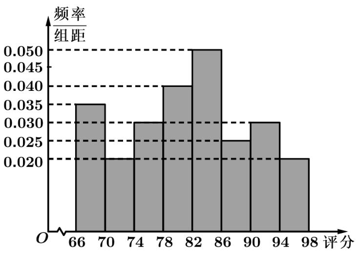

<!-- question-source:start -->
2. (2021·天津·高考真题) 从某网络平台推荐的影视作品中抽取 $^{400}$ 部，统计其评分数据，将所得 $^{400}$ 个评分数据分为8组： $[66,70)$ 、 $[70,74)$ 、L、 $[94,98]$ ，并整理得到如下的频率分布直方图，则评分在区间 $\left[82,86\right)$ 内的影视作品数量是（）

<!-- question-source:end -->

![[高中/真题/按题型分类/专题06 统计与数字特征小题综合/考点02_图表类统计图综合/真题/answers/Q00033842A1.md]]
