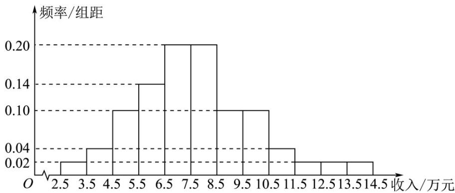

<!-- question-source:start -->
4. （2021·全国甲卷·高考真题）为了解某地农村经济情况，对该地农户家庭年收入进行抽样调查，将农户家庭年收入的调查数据整理得到如下频率分布直方图：

根据此频率分布直方图，下面结论中不正确的是（）
A. 该地农户家庭年收入低于 $4.5$ 万元的农户比率估计为 $6\%$ B. 该地农户家庭年收入不低于 $10.5$ 万元的农户比率估计为 $10\%$ C. 估计该地农户家庭年收入的平均值不超过 $6.5$ 万元

D．估计该地有一半以上的农户，其家庭年收入介于4.5万元至8.5万元之间
<!-- question-source:end -->

![[高中/真题/按题型分类/专题06 统计与数字特征小题综合/考点02_图表类统计图综合/真题/answers/Q00033843A1.md]]
