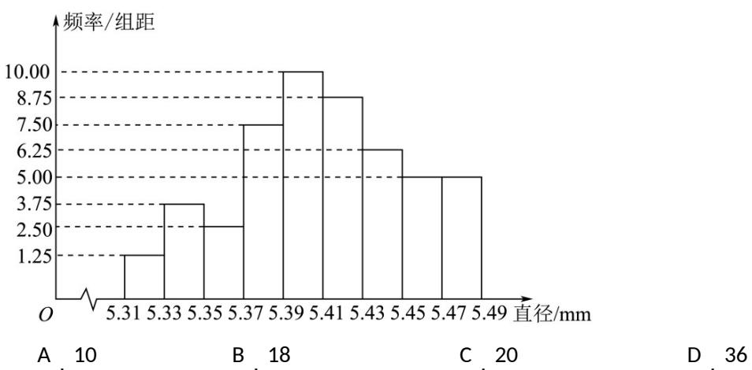

<!-- question-source:start -->
5.（2020·天津·高考真题）从一批零件中抽取 $^{80}$ 个，测量其直径（单位：mm），将所得数据分为 $^{9}$ 组： $[5.31,5.33),[5.33,5.35),\cdots,[5.45,5.47),[5.47,5.49]$ ，并整理得到如下频率分布直方图，则在被抽取的零件中，直径落在区间 $[5.43,5.47)$ 内的个数为（）

<!-- question-source:end -->

![[高中/真题/按题型分类/专题06 统计与数字特征小题综合/考点02_图表类统计图综合/真题/answers/Q00033845A1.md]]
