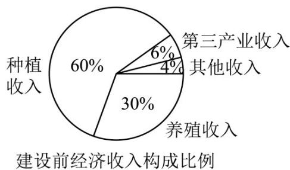
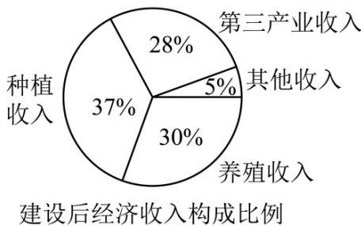

<!-- question-source:start -->
6.（2018·全国·高考真题）某地区经过一年的新农村建设，农村的经济收入增加了一倍。实现翻番。为更好地了解该地区农村的经济收入变化情况，统计了该地区新农村建设前后农村的经济收入构成比例。得到如下饼图：

则下面结论中不正确的是A. 新农村建设后，种植收入减少B. 新农村建设后，其他收入增加了一倍以上C. 新农村建设后，养殖收入增加了一倍D. 新农村建设后，养殖收入与第三产业收入的总和超过了经济收入的一半
<!-- question-source:end -->

![[高中/真题/按题型分类/专题06 统计与数字特征小题综合/考点02_图表类统计图综合/真题/answers/Q00033846A1.md]]
