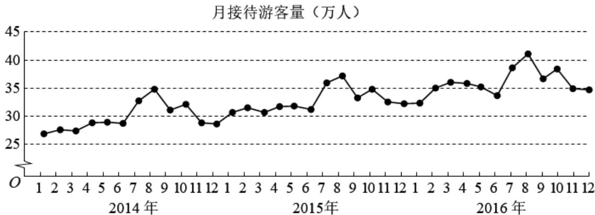

<!-- question-source:start -->
7. （2017·全国·高考真题）某城市为了解游客人数的变化规律，提高旅游服务质量，收集并整理了2014年1月至2016年12月期间月接待游客量（单位：万人）的数据，绘制了如图所示的折线图·根据该折线图，下列结论错误的是（）

A. 月接待游客量逐月增加
B. 年接待游客量逐年增加
C. 各年的月接待游客量高峰期大致在 $7,8$ 月
D. 各年 $1$ 月至 $6$ 月的月接待游客量相对于 $7$ 月至 $12$ 月，波动性更小，变化比较平稳
<!-- question-source:end -->

![[高中/真题/按题型分类/专题06 统计与数字特征小题综合/考点02_图表类统计图综合/真题/answers/Q00033847A1.md]]
