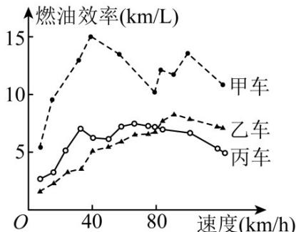

<!-- question-source:start -->
8. (2015·北京·高考真题) 汽车的“燃油效率”是指汽车每消耗 $^{1}$ 升汽油行驶的里程，下图描述了甲、乙、丙三辆汽车在不同速度下的燃油效率情况：下列叙述中正确的是

A. 消耗 $^{1}$ 升汽油，乙车最多可行驶 $^{5}$ 千米
B. 以相同速度行驶相同路程，三辆车中，甲车消耗汽油最多
C. 甲车以 $^{80}$ 千米/小时的速度行驶 $^{1}$ 小时，消耗 $^{10}$ 升汽油
D. 某城市机动车最高限速 $^{80}$ 千米/小时·相同条件下，在该市用丙车比用乙车更省油
<!-- question-source:end -->

![[高中/真题/按题型分类/专题06 统计与数字特征小题综合/考点02_图表类统计图综合/真题/answers/Q00033848A1.md]]
