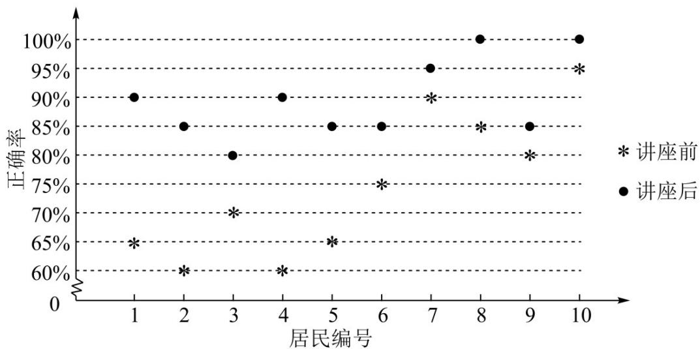

<!-- question-source:start -->
3. （2022·全国甲卷·高考真题）某社区通过公益讲座以普及社区居民的垃圾分类知识。为了解讲座效果，随机抽取 $^{10}$ 位社区居民，让他们在讲座前和讲座后各回答一份垃圾分类知识问卷，这 $^{10}$ 位社区居民在讲座前和讲座后问卷答题的正确率如下图：

则（ ）A. 讲座前问卷答题的正确率的中位数小于 $70\%$ B. 讲座后问卷答题的正确率的平均数大于 $85\%$ C. 讲座前问卷答题的正确率的标准差小于讲座后正确率的标准差D. 讲座后问卷答题的正确率的极差大于讲座前正确率的极差
<!-- question-source:end -->

![[高中/真题/按题型分类/专题06 统计与数字特征小题综合/考点03_样本的数字特征/真题/answers/Q00033851A1.md]]
