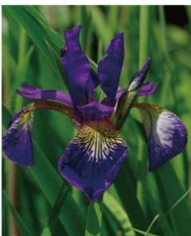
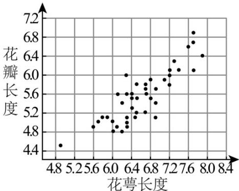

<!-- question-source:start -->
2.（2023·天津·高考真题）鸢是鹰科的一种鸟，《诗经·大雅·旱麓》曰：“鸢飞戾天，鱼跃余渊”·鸢尾花因花瓣形如鸢尾而得名，寓意鹏程万里、前途无量·通过随机抽样，收集了若干朵某品种鸢尾花的花萼长度和花瓣长度（单位：cm），绘制散点图如图所示，计算得样本相关系数为 $r = 0.8642$ ，利用最小二乘法求得相应的经验回归方程为 $\hat{y} = 0.7501x + 0.6105$ ，根据以上信息，如下判断正确的为（）

A. 花瓣长度和花萼长度不存在相关关系
B. 花瓣长度和花萼长度负相关
C. 花萼长度为 $7\mathrm{cm}$ 的该品种鸢尾花的花瓣长度的平均值为 $5.8612\mathrm{cm}$ D. 若从样本中抽取一部分，则这部分的相关系数一定是0.8642
<!-- question-source:end -->

![[高中/真题/按题型分类/专题06 统计与数字特征小题综合/考点04_变量间的相关关系/真题/answers/Q00033871A1.md]]
