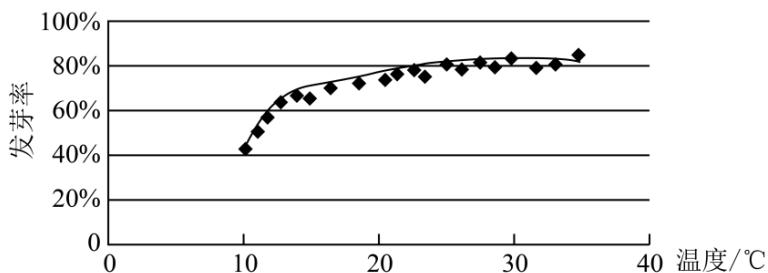

<!-- question-source:start -->
3. (2020·全国·高考真题) 某校一个课外学习小组为研究某作物种子的发芽率 $Y$ 和温度 $X$ (单位： ${}^{\circ}\mathrm{C}$ ) 的关系，在 20 个不同的温度条件下进行种子发芽实验，由实验数据 $(x_{i}, y_{i}) (i = 1, 2, \dots, 20)$ 得到下面的散点图：

由此散点图，在 $10^{\circ} \mathrm{C}$ 至 $40^{\circ} \mathrm{C}$ 之间，下面四个回归方程类型中最适宜作为发芽率 $y$ 和温度 $x$ 的回归方程类型的是（）

A. $y = a + bx$ B. $y = a + bx^2$ C. $y = a + be^{x}$ D. $y = a + b\ln x$
<!-- question-source:end -->

![[高中/真题/按题型分类/专题06 统计与数字特征小题综合/考点04_变量间的相关关系/真题/answers/Q00033872A1.md]]
