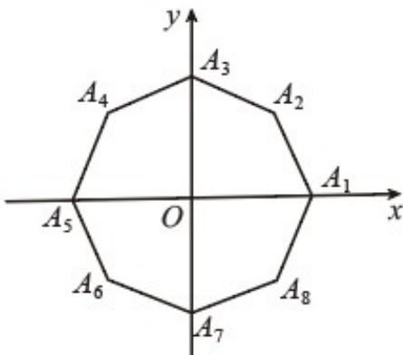

<!-- question-source:start -->
32．（2016·上海·高考真题）如图，在平面直角坐标系 $xOy$ 中， $\mathrm{O}$ 为正八边形 $A_{1}A_{2}\cdots A_{8}$ 的中心， $A_{1}(1,0)$ 。任取不同的两点 $A_{i}, A_{j}$ ，点 $\mathsf{P}$ 满足 $\overrightarrow{OP} + \overrightarrow{OA_{i}} + \overrightarrow{OA_{j}} = \overrightarrow{0}$ ，则点 $\mathsf{P}$ 落在第一象限的概率是 \_\_\_\_。

<!-- question-source:end -->

![[高中/真题/按题型分类/专题07 事件与概率/考点02_古典概率/真题/answers/Q00033906A1.md]]
