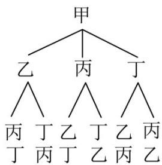
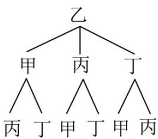
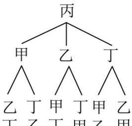
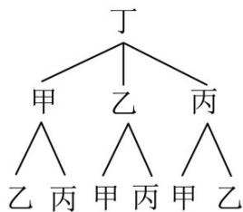

> [!faq]- 《专题07 事件与概率》真题解析
>
> > [!success]- **【答案】** B
>
> > [!note]- **【分析】**
> > 解法一：画出树状图，结合古典概型概率公式即可求解·
> >
> > 解法二：分类讨论甲乙的位置，结合得到符合条件的情况，然后根据古典概型计算公式进行求解
>
> > [!note]- **【解析】**
> > 解法一：画出树状图，如图，
> > 
> > 
> > 丙丁甲丁甲丙
> > 丁丙丁甲丙甲
> > 
> > 
> > 丙乙丙甲乙甲
> > 由树状图可得，甲、乙、丙、丁四人排成一列，共有 $^{24}$ 种排法，
> > 其中丙不在排头，且甲或乙在排尾的排法共有 $^{8}$ 种，
> > 故所求概率 $P=\frac{8}{24}=\frac{1}{3}$ .
> > 解法二：当甲排在排尾，乙排第一位，丙有2种排法，丁就1种，共2种；当甲排在排尾，乙排第二位或第三位，丙有1种排法，丁就1种，共2种；
> > 于是甲排在排尾共4种方法，同理乙排在排尾共4种方法，于是共8种排法符合题意；基本事件总数显然是 $A_{4}^{4}=24$ ，
> > 根据古典概型的计算公式，丙不在排头，甲或乙在排尾的概率为 $\frac{8}{24} = \frac{1}{3}$ .
> >
> > 故选 **B**
