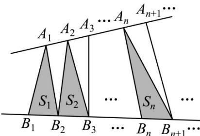

<!-- question-source:start -->
11.（2016·浙江·高考真题）如图，点列 $\{A_{n}\}$ ， $\{B_{n}\}$ 分别在某锐角的两边上，且 $\left|A_{n}A_{n+1}\right| = \left|A_{n+1}A_{n+2}\right|, A_{n} \neq A_{n+2}, n \in N^{*}$ ， $\left|B_{n}B_{n+1}\right| = \left|B_{n+1}B_{n+2}\right|, B_{n} \neq B_{n+2}, n \in N^{*}$ .（ $P \neq Q$ 表示点 $P$ 与 $Q$ 不重合）

若 $d_{n} = \left|A_{n}B_{n}\right|$ ， $S_{n}$ 为 $\triangle A_{n}B_{n}B_{n+1}$ 的面积，则

A. $\{S_n\}$ 是等差数列
B. $\{S_n^2\}$ 是等差数列
C. $\{d_n\}$ 是等差数列
D. $\{d_n^2\}$ 是等差数列
<!-- question-source:end -->

![[高中/真题/按题型分类/专题08 数列小题综合/考点03_等差数列及其前n项和/真题/answers/Q00033939A1.md]]
