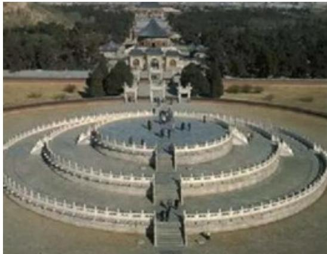

<!-- question-source:start -->
6. (2020·全国·高考真题) 北京天坛的圜丘坛为古代祭天的场所, 分上、中、下三层, 上层中心有一块圆形石板(称为天心石), 环绕天心石砌 $^{9}$ 块扇面形石板构成第一环, 向外每环依次增加 $^{9}$ 块, 下一层的第一环比上一层的最后一环多 $^{9}$ 块, 向外每环依次也增加 $^{9}$ 块, 已知每层环数相同, 且下层比中层多 $^{729}$ 块, 则三层共有扇面形石板(不含天心石)( )

A.3699块 B.3474块 C.3402块 D.3339块
<!-- question-source:end -->

![[高中/真题/按题型分类/专题08 数列小题综合/考点05_数列中的数学文化/真题/answers/Q00033985A1.md]]
