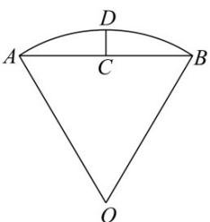

<!-- question-source:start -->
1. （2022·全国甲卷·高考真题）沈括的《梦溪笔谈》是中国古代科技史上的杰作，其中收录了计算圆弧长度的“会圆术”，如图，AB是以O为圆心，OA为半径的圆弧，C是AB的中点，D在AB上，CD⊥AB．
“会圆术”给出 $\frac{AB}{AB}$ 的弧长的近似值s的计算公式： $s=AB+\frac{CD^{2}}{OA}$ ．当OA=2, $\angle AOB=60^{\circ}$ 时， $s=(\quad)$

A. $\frac{11 - 3\sqrt{3}}{2}$ B. $\frac{11 - 4\sqrt{3}}{2}$ C. $\frac{9 - 3\sqrt{3}}{2}$ D. $\frac{9 - 4\sqrt{3}}{2}$
<!-- question-source:end -->

![[高中/真题/按题型分类/专题09 三角函数的图象与性质小题综合/考点01_任意角和弧度制及求扇形的弧长_面积计算/真题/answers/Q00033992A1.md]]
