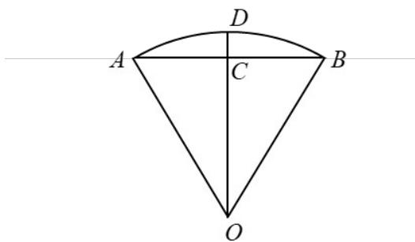

> [!faq]- 《专题09 三角函数的图象与性质小题综合》真题解析
>
> > [!success]- **【答案】** B
>
> > [!note]- **【分析】**
> > 【分析】连接 OC，分别求出 AB, OC, CD，再根据题中公式即可得出答案.
>
> > [!note]- **【解析】**
> > 【详解】解：如图，连接OC
> > 因为 $C$ 是 $AB$ 的中点，
> > 所以 $OC \perp AB$
> > 又 $CD \perp AB$ ，所以 O, C, D 三点共线，
> > 即 $OD = OA = OB = 2$
> > 又 $\angle AOB = 60^{\circ}$
> > 所以 $AB = OA = OB = 2$
> > 则 $OC = \sqrt{3}$ ，故 $CD = 2 - \sqrt{3}$
> > 所以 $s = AB + \frac{CD^{2}}{OA} = 2 + \frac{\left(2 - \sqrt{3}\right)^{2}}{2} = \frac{11 - 4\sqrt{3}}{2}$ .
> > 
> >
> > 故选 **B**.
