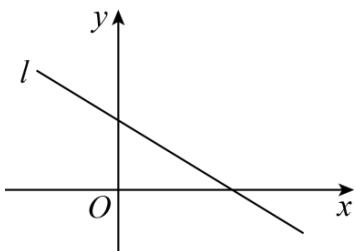

<!-- question-source:start -->
1. (2020·山东·高考真题) 已知直线 $l: y = x \sin \theta + \cos \theta$ 的图像如图所示, 则角 $\theta$ 是 ( )

A. 第一象限角 B. 第二象限角 C. 第三象限角 D. 第四象限角
<!-- question-source:end -->

![[高中/真题/按题型分类/专题09 三角函数的图象与性质小题综合/考点02_任意角的三角函数/真题/answers/Q00033995A1.md]]
