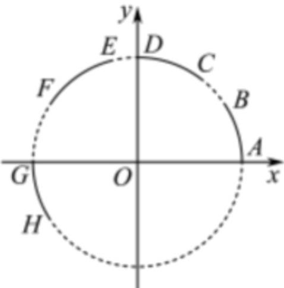

<!-- question-source:start -->
3．（2018·北京·高考真题）在平面直角坐标系中，AB,CD,EF,GH是圆 $x^{2}+y^{2}=1$ 上的四段弧（如图），点P在其中一段上，角 $\alpha$ 以Ox为始边，OP为终边，若 $\tan\alpha<\cos\alpha<\sin\alpha$ ，则P所在的圆弧是

A. AB B. CD

C. $EF$ D. $GH$
<!-- question-source:end -->

![[高中/真题/按题型分类/专题09 三角函数的图象与性质小题综合/考点02_任意角的三角函数/真题/answers/Q00033997A1.md]]
