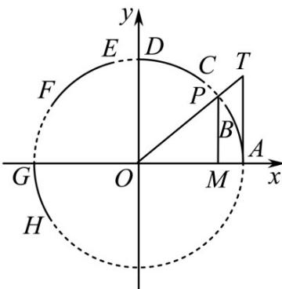

> [!faq]- 《专题09 三角函数的图象与性质小题综合》真题解析
>
> > [!success]- **【答案】** C
>
> > [!note]- **【分析】**
> > 本题未单列分析。
>
> > [!note]- **【解析】**
> > 【答案】C
> > 【详解】分析：逐个分析 A、B、C、D 四个选项，利用三角函数的三角函数线可得正确结论·
> > 详解：由下图可得：有向线段 $OM$ 为余弦线，有向线段 $MP$ 为正弦线，有向线段 $AT$ 为正切线·
> > 
> > A 选项：当点 P 在 AB 上时， $\cos\alpha=x,\sin\alpha=y$
> > $\therefore \cos\alpha > \sin\alpha$ ，故 $^{A}$ 选项错误；
> > B选项：当点 $P$ 在 $\mathbb{E}D$ 上时， $\cos \alpha = x, \sin \alpha = y$ ， $\tan \alpha = \frac{y}{x}$ ，
> > $\therefore \tan \alpha > \sin \alpha > \cos \alpha$ ，故 $^B$ 选项错误；
> > $^{C}$ 选项：当点 $P$ 在 $\overline{EF}$ 上时， $\cos\alpha=x,\sin\alpha=y$ ， $\tan\alpha=\frac{y}{x}$ ，
> > $\therefore \sin \alpha > \cos \alpha > \tan \alpha$ ，故 $C$ 选项正确；
> > D 选项：点 P 在 GH 上且 GH 在第三象限， $\tan \alpha > 0, \sin \alpha < 0, \cos \alpha < 0$ ，故 D 选项错误·综上，故选 C.
> > 点睛：此题考查三角函数的定义，解题的关键是能够利用数形结合思想，作出图形，找到 $\sin \alpha, \cos \alpha, \tan \alpha$ 所对应的三角函数线进行比较.
