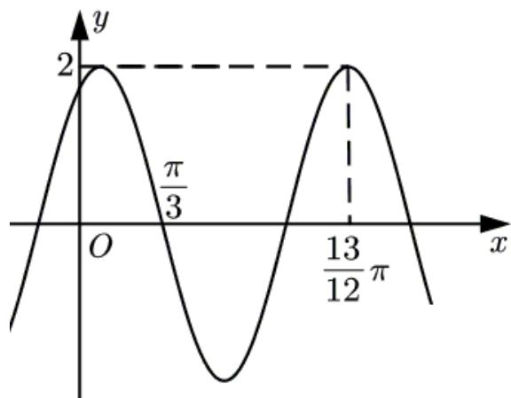

<!-- question-source:start -->
9．（2021·全国甲卷·高考真题）已知函数 $f(x)=2\cos(\omega x+\varphi)$ 的部分图像如图所示，则满足条件 $\left(f(x)-f\left(-\frac{7\pi}{4}\right)\right)\left(f(x)-f\left(\frac{4\pi}{3}\right)\right)>0$ 的最小正整数x为\_\_\_\_。

<!-- question-source:end -->

![[高中/真题/按题型分类/专题09 三角函数的图象与性质小题综合/考点05_三角函数的图象与性质_基础_/真题/answers/Q00034023A1.md]]
