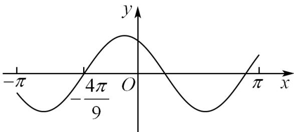

<!-- question-source:start -->
11．（2020·全国·高考真题）设函数 $f(x)=\cos(\omega x+\frac{\pi}{6})$ 在 $[-π,π]$ 的图像大致如下图，则 $f(x)$ 的最小正周期为（）

A. $\frac{10\pi}{9}$ B. $\frac{7\pi}{6}$ C. $\frac{4\pi}{3}$ D. $\frac{3\pi}{2}$
<!-- question-source:end -->

![[高中/真题/按题型分类/专题09 三角函数的图象与性质小题综合/考点06_三角函数的图象与性质_拔高_/真题/answers/Q00034038A1.md]]
