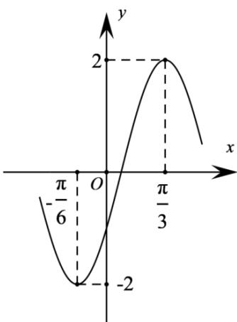

<!-- question-source:start -->
20. (2016·全国·高考真题) 函数 $y = A \sin (\omega x + \varphi)$ 的部分图象如图所示，则

A. $y = 2\sin \left(2x - \frac{\pi}{6}\right)$

B. $y = 2\sin (2x - \frac{\pi}{3})$ C. $y = 2\sin (x + \frac{\pi}{6})$ D. $y = 2\sin (x + \frac{\pi}{3})$
<!-- question-source:end -->

![[高中/真题/按题型分类/专题09 三角函数的图象与性质小题综合/考点06_三角函数的图象与性质_拔高_/真题/answers/Q00034046A1.md]]
