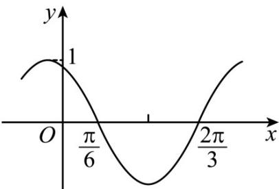

<!-- question-source:start -->
28. (2020·山东·高考真题) 下图是函数 $y = \sin (\omega x + \varphi)$ 的部分图像，则 $\sin (\omega x + \varphi) =$ （）

A. $\sin (x + \frac{\pi}{3})$ B. $\sin (\frac{\pi}{3} -2x)$ C. $\cos (2x + \frac{\pi}{6})$ D. $\cos (\frac{5\pi}{6} -2x)$
<!-- question-source:end -->

![[高中/真题/按题型分类/专题09 三角函数的图象与性质小题综合/考点06_三角函数的图象与性质_拔高_/真题/answers/Q00034054A1.md]]
