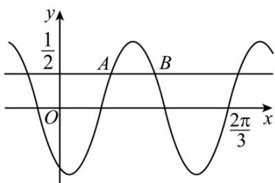

<!-- question-source:start -->
30．（2023·全国新Ⅱ卷·高考真题）已知函数 $f(x) = \sin (\omega x + \varphi)$ ，如图 $A, B$ 是直线 $y = \frac{1}{2}$ 与曲线 $y = f(x)$ 的两个交点，若 $|AB| = \frac{\pi}{6}$ ，则 $f(\pi) =$ \_\_\_\_.

<!-- question-source:end -->

![[高中/真题/按题型分类/专题09 三角函数的图象与性质小题综合/考点06_三角函数的图象与性质_拔高_/真题/answers/Q00034056A1.md]]
