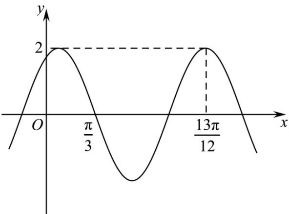

<!-- question-source:start -->
31. (2021·全国甲卷·高考真题) 已知函数 $f(x) = 2\cos (\omega x + \varphi)$ 的部分图像如图所示，则 $f\left(\frac{\pi}{2}\right) =$

<!-- question-source:end -->

![[高中/真题/按题型分类/专题09 三角函数的图象与性质小题综合/考点06_三角函数的图象与性质_拔高_/真题/answers/Q00034057A1.md]]
