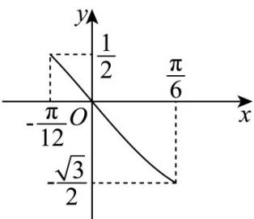

> [!faq]- 《专题09 三角函数的图象与性质小题综合》真题解析
>
> > [!success]- **【答案】** A
>
> > [!note]- **【分析】**
> > 先由诱导公式化简，结合周期公式求出 $\omega$ ，得 $f(x) = -\sin 2x$ ，再整体求出 $x \in \left[-\frac{\pi}{12}, \frac{\pi}{6}\right]$ 时， $2x$ 的范围，结合正弦三角函数图象特征即可求解.
>
> > [!note]- **【解析】**
> > $f(x) = \sin 3\left(\omega x + \frac{\pi}{3}\right) = \sin (3\omega x + \pi) = -\sin 3\omega x$ ，由 $T = \frac{2\pi}{3\omega} = \pi$ 得 $\omega = \frac{2}{3}$
> > 即 $f(x) = -\sin 2x$ ，当 $x \in \left[-\frac{\pi}{12}, \frac{\pi}{6}\right]$ 时， $2x \in \left[-\frac{\pi}{6}, \frac{\pi}{3}\right]$
> > 画出 $f(x) = -\sin 2x$ 图象，如下图，
> > 由图可知， $f(x) = -\sin 2x$ 在 $\left[-\frac{\pi}{12}, \frac{\pi}{6}\right]$ 上递减，
> > 所以，当 $x = \frac{\pi}{6}$ 时， $f(x)_{\min} = -\sin \frac{\pi}{3} = -\frac{\sqrt{3}}{2}$
> > 
> >
> > 故选 **A**
