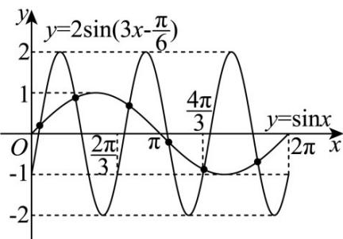

> [!faq]- 《专题09 三角函数的图象与性质小题综合》真题解析
>
> > [!success]- **【答案】** C
>
> > [!note]- **【分析】**
> > 画出两函数在 $[0,2\pi]$ 上的图象，根据图象即可求解
>
> > [!note]- **【解析】**
> > 因为函数 $y = \sin x$ 的的最小正周期为 $T = 2\pi$ ，函数 $y = 2\sin \left(3x - \frac{\pi}{6}\right)$ 的最小正周期为 $T = \frac{2\pi}{3}$ ，所以在 $x\in [0,2\pi ]$ 上函数 $y = 2\sin \left(3x - \frac{\pi}{6}\right)$ 有三个周期的图象，在坐标系中结合五点法画出两函数图象，如图所示：
> > 
> > 由图可知，两函数图象有 $^{6}$ 个交点·
> >
> > 故选 **C**
