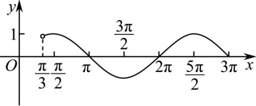

> [!faq]- 《专题09 三角函数的图象与性质小题综合》真题解析
>
> > [!success]- **【答案】** C
>
> > [!note]- **【分析】**
> > 【分析】由 $x$ 的取值范围得到 $\omega x + \frac{\pi}{3}$ 的取值范围，再结合正弦函数的性质得到不等式组，解得即可.【详解】解：依题意可得 $\omega > 0$ ，因为 $x \in (0, \pi)$ ，所以 $\omega x + \frac{\pi}{3} \in \left(\frac{\pi}{3}, \omega \pi + \frac{\pi}{3}\right)$ ，
> >
> > 要使函数在区间 $(0, \pi)$ 恰有三个极值点、两个零点，又 $y = \sin x$ ， $x \in \left(\frac{\pi}{3}, 3\pi\right)$ 的图象如下所示：
> >
> > 
> >
> > 则 $\frac{5\pi}{2} < \omega \pi + \frac{\pi}{3} \leq 3\pi$ ，解得 $\frac{13}{6} < \omega \leq \frac{8}{3}$ ，即 $\omega \in \left(\frac{13}{6}, \frac{8}{3}\right]$
> >
> > 故选：C
>
> > [!note]- **【解析】**
> > 本题未单列解析。
