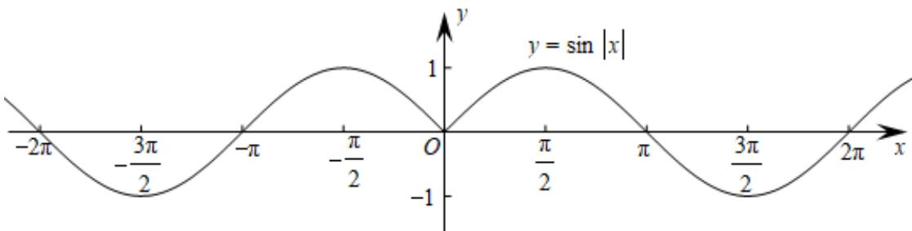
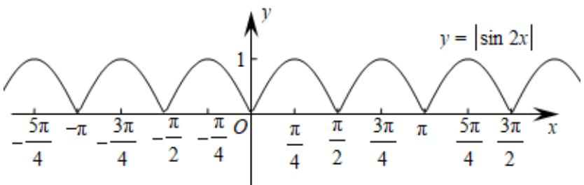
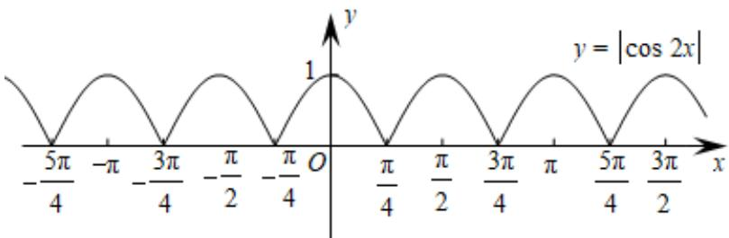

> [!faq]- 《专题09 三角函数的图象与性质小题综合》真题解析
>
> > [!success]- **【答案】** A
>
> > [!note]- **【分析】**
> > 本题主要考查三角函数图象与性质，渗透直观想象、逻辑推理等数学素养．画出各函数图象，即可做出选择．
>
> > [!note]- **【解析】**
> > 因为 $y = \sin |x|$ 图象如下图，知其不是周期函数，排除 D；因为 $y = \cos |x| = \cos x$ ，周期为 $2\pi$ ，排除 C，作出 $y = |\cos 2x|$ 图象，由图象知，其周期为 $\frac{\pi}{2}$ ，在区间 $(\frac{\pi}{4}, \frac{\pi}{2})$ 单调递增，A 正确；作出 $y = |\sin 2x|$ 的图象，由图象知，其周期为 $\frac{\pi}{2}$ ，在区间 $(\frac{\pi}{4}, \frac{\pi}{2})$ 单调递减，排除 B，故选 A。
> > 
> > 
> > 
> > 【点睛】
> > 利用二级结论：①函数 $y = |f(x)|$ 的周期是函数 $y = f(x)$ 周期的一半；
> > - **②**：$y = \sin |\omega x|$ 不是周期函数；
