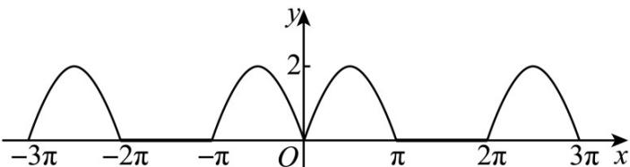

> [!faq]- 《专题09 三角函数的图象与性质小题综合》真题解析
>
> > [!success]- **【答案】** C
>
> > [!note]- **【分析】**
> > 化简函数 $f(x) = \sin |x| + |\sin x|$ ，研究它的性质从而得出正确答案。
>
> > [!note]- **【解析】**
> > ∵ $f(-x)=\sin|-x|+\left|\sin(-x)\right|=\sin|x|+\left|\sin x\right|=f(x)$ , ∴ $f(x)$ 为偶函数，故①正确．当 $\frac{\pi}{2}<x<\pi$ 时， $f(x)=2\sin x$ ，它在区间 $\left(\frac{\pi}{2},\pi\right)$ 单调递减，故②错误．当 $0\leq x\leq\pi$ 时， $f(x)=2\sin x$ ，它有两个零点： $0,\pi$ ；当 $-\pi\leq x<0$ 时， $f(x)=\sin(-x)-\sin x=-2\sin x$ ，它有一个零点： $-\pi$ ，故 $f(x)$ 在 $[-π,π]$ 有3个零点： $-π,0,\pi$ ，故③错误．当 $x\in[2k\pi,2k\pi+\pi](k\in N^{*})$ 时， $f(x)=2\sin x$ ；当 $x\in[2k\pi+\pi,2k\pi+2\pi](k\in N^{*})$ 时， $f(x)=\sin x-\sin x=0$ ，又 $f(x)$ 为偶函数， $\backslash f(x)$ 的最大值为2，故④正确．综上所述，①④ 正确，故选C.
> > 【点睛】画出函数 $f(x) = \sin |x| + |\sin x|$ 的图象，由图象可得①④正确，故选C.
> > 
