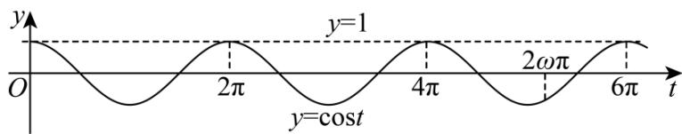

> [!faq]- 《专题09 三角函数的图象与性质小题综合》真题解析
>
> > [!success]- **【答案】** 详见解析
>
> > [!note]- **【分析】**
> > 【分析】令 $f(x)=0$ ，得 $\cos\omega x=1$ 有 3 个根，从而结合余弦函数的图像性质即可得解.
>
> > [!note]- **【解析】**
> > 【详解】因为 $0 \leq x \leq 2\pi$ ，所以 $0 \leq \omega x \leq 2\omega\pi$ ，
> > 令 $f(x)=\cos\omega x-1=0$ ，则 $\cos\omega x=1$ 有3个根，
> > 令 $t = \omega x$ ，则 $\cos t = 1$ 有3个根，其中 $t\in [0,2\omega \pi ]$
> > 结合余弦函数 $y = \cos t$ 的图像性质可得 $4\pi \leq 2\omega\pi < 6\pi$ ，故 $2 \leq \omega < 3$ ，
> > 
> > 故答案为：[2,3).
