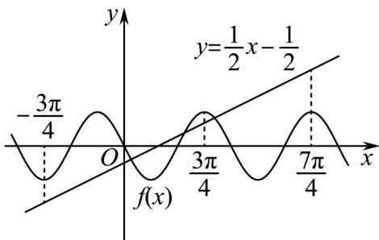

> [!faq]- 《专题09 三角函数的图象与性质小题综合》真题解析
>
> > [!success]- **【答案】** C
>
> > [!note]- **【分析】**
> > 先利用三角函数平移的性质求得 $f(x) = -\sin 2x$ ，再作出 $f(x)$ 与 $y = \frac{1}{2} x - \frac{1}{2}$ 的部分大致图像，考虑特殊点处 $f(x)$ 与 $y = \frac{1}{2} x - \frac{1}{2}$ 的大小关系，从而精确图像，由此得解·
>
> > [!note]- **【解析】**
> > 因为 $y = \cos \left(2x + \frac{\pi}{6}\right)$ 向左平移 $\frac{\pi}{6}$ 个单位所得函数为 $y = \cos \left[2\left(x + \frac{\pi}{6}\right) + \frac{\pi}{6}\right] = \cos \left(2x + \frac{\pi}{2}\right) = -\sin 2x$ 所以 $f(x) = -\sin 2x$ ,
> > 而 $y = \frac{1}{2} x - \frac{1}{2}$ 显然过 $\left(0, -\frac{1}{2}\right)$ 与 $(1,0)$ 两点，
> > 作出 $f(x)$ 与 $y = \frac{1}{2} x - \frac{1}{2}$ 的部分大致图像如下，
> > 
> > 考虑 $2x = -\frac{3\pi}{2}, 2x = \frac{3\pi}{2}, 2x = \frac{7\pi}{2}$ ，即 $x = -\frac{3\pi}{4}, x = \frac{3\pi}{4}, x = \frac{7\pi}{4}$ 处 $f(x)$ 与 $y = \frac{1}{2} x - \frac{1}{2}$ 的大小关系，当 $x = -\frac{3\pi}{4}$ 时， $f\left(-\frac{3\pi}{4}\right) = -\sin \left(-\frac{3\pi}{2}\right) = -1$ ， $y = \frac{1}{2} \times \left(-\frac{3\pi}{4}\right) - \frac{1}{2} = -\frac{3\pi + 4}{8} < -1$ ；
> > 当 $x = \frac{3\pi}{4}$ 时， $f\left(\frac{3\pi}{4}\right) = -\sin \frac{3\pi}{2} = 1$ ， $y = \frac{1}{2} \times \frac{3\pi}{4} - \frac{1}{2} = \frac{3\pi - 4}{8} < 1$ ；
> > 当 $x = \frac{7\pi}{4}$ 时， $f\left(\frac{7\pi}{4}\right) = -\sin \frac{7\pi}{2} = 1$ ， $y = \frac{1}{2} \times \frac{7\pi}{4} - \frac{1}{2} = \frac{7\pi - 4}{8} > 1$ ；
> > 所以由图可知， $f(x)$ 与 $y = \frac{1}{2} x - \frac{1}{2}$ 的交点个数为3.
> >
> > 故选 **C**.
