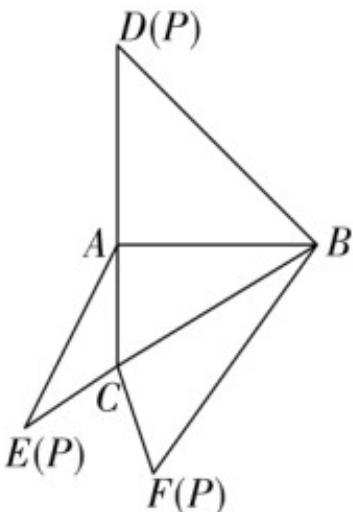

<!-- question-source:start -->
6. (2020·全国·高考真题) 如图, 在三棱锥 $P-ABC$ 的平面展开图中, $AC=1$ , $AB=AD=\sqrt{3}$ , $AB \perp AC$ , $AB \perp AD$ , $\angle CAE=30^{\circ}$ , 则 $\cos \angle FCB=$ \_\_\_\_.

<!-- question-source:end -->

![[高中/真题/按题型分类/专题10 三角恒等变换与解三角形小题综合/考点04解三角形小题综合之求角和求三角函数函数值/真题/answers/Q00034122A1.md]]
