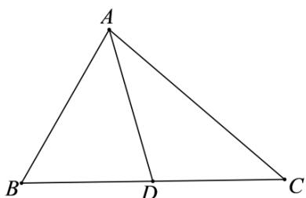

> [!faq]- 《专题10 三角恒等变换与解三角形小题综合》真题解析
>
> > [!success]- **【答案】** 详见解析
>
> > [!note]- **【分析】**
> > 【分析】方法一：利用余弦定理求出 AC，再根据等面积法求出 AD；
> >
> > 方法二：利用余弦定理求出 $AC$ ，再根据正弦定理求出 $B,C$ ，即可根据三角形的特征求出.
>
> > [!note]- **【解析】**
> > 【详解】
> > 
> > 如图所示：记 $AB = c, AC = b, BC = a$
> > 方法一：由余弦定理可得， $2^{2}+b^{2}-2\times2\times b\times\cos60^{\circ}=6$
> > 因为 $b > 0$ ，解得： $b = 1 + \sqrt{3}$
> > 由 $S_{\triangle ABC} = S_{\triangle ABD} + S_{\triangle ACD}$ 可得，
> > $$
> > \frac {1}{2} \times 2 \times b \times \sin 6 0 ^ {\circ} = \frac {1}{2} \times 2 \times A D \times \sin 3 0 ^ {\circ} + \frac {1}{2} \times A D \times b \times \sin 3 0 ^ {\circ}
> > $$
> > 解得： $AD = \frac{\sqrt{3}b}{1 + \frac{b}{2}} = \frac{2\sqrt{3}\left(1 + \sqrt{3}\right)}{3 + \sqrt{3}} = 2$
> > 故答案为：2.
> > 方法二：由余弦定理可得， $2^{2} + b^{2} - 2 \times 2 \times b \times \cos 60^{\circ} = 6$ ，因为 $b > 0$ ，解得： $b = 1 + \sqrt{3}$
> > 由正弦定理可得， $\frac{\sqrt{6}}{\sin 60^{\circ}} = \frac{b}{\sin B} = \frac{2}{\sin C}$ ，解得： $\sin B = \frac{\sqrt{6} + \sqrt{2}}{4}$ ， $\sin C = \frac{\sqrt{2}}{2}$
> > 因为 $1 + \sqrt{3} >\sqrt{6} >\sqrt{2}$ ，所以 $C = 45^{\circ}$ ， $B = 180^{\circ} - 60^{\circ} - 45^{\circ} = 75^{\circ}$
> > 又 $\angle BAD = 30^{\circ}$ ，所以 $\angle ADB = 75^{\circ}$ ，即 $AD = AB = 2$
> > 故答案为：2.
> > 【点睛】本题压轴相对比较简单，既可以利用三角形的面积公式解决角平分线问题，也可以用角平分定义结合正弦定理、余弦定理求解，知识技能考查常规。
