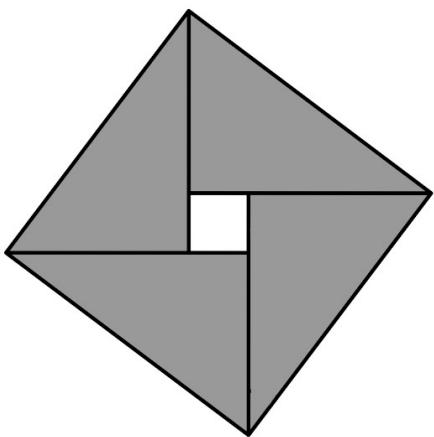

<!-- question-source:start -->
2. (2021·浙江·高考真题) 我国古代数学家赵爽用弦图给出了勾股定理的证明·弦图是由四个全等的直角三角形和中间的一个小正方形拼成的一个大正方形(如图所示)·若直角三角形直角边的长分别是 $^{3}$ , $^{4}$ , 记大正方形的面积为 $S_{1}$ , 小正方形的面积为 $S_{2}$ , 则 $\frac{S_{1}}{S_{2}} =$ \_\_\_\_.

<!-- question-source:end -->

![[高中/真题/按题型分类/专题10 三角恒等变换与解三角形小题综合/考点06_解三角形小题综合之求面积/真题/answers/Q00034150A1.md]]
