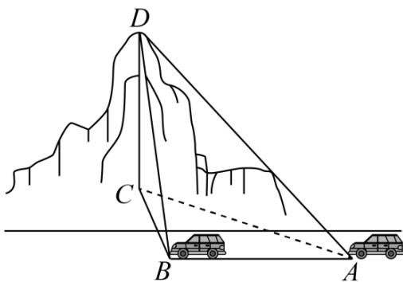

<!-- question-source:start -->
4.（2015·湖北·高考真题）如图，一辆汽车在一条水平的公路上向正西行驶，到A处时测得公路北侧一山顶D在西偏北 $30^{\circ}$ 的方向上，行驶600m后到达B处，测得此山顶在西偏北 $75^{\circ}$ 的方向上，仰角为 $30^{\circ}$ ，则此山的高度CD= \_\_\_\_ m.

<!-- question-source:end -->

![[高中/真题/按题型分类/专题10 三角恒等变换与解三角形小题综合/考点07_解三角形小题综合之求最值或范围/对点训练/answers/Q00054819A1.md]]
