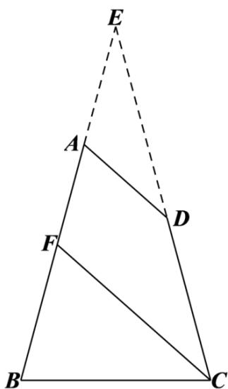

> [!faq]- 《zhenti-专题10 三角恒等变换与解三角形小题综合》例题解析
>
> > [!success]- **【答案】** （ $\sqrt{6} - \sqrt{2}$ ， $\sqrt{6} + \sqrt{2}$ ）
>
> > [!note]- **【解析】**
> > 如图所示，延长 $BA$ ，CD交于E，平移AD，当A与D重合与E点时，AB最长，在△BCE中，
> >
> > $\angle B = \angle C = 75^{\circ}$ ， $\angle E = 30^{\circ}$ ，BC=2，由正弦定理可得 $\frac{BC}{\sin\angle E} = \frac{BE}{\sin\angle C}$ ，即 $\frac{2}{\sin 30^{\circ}} = \frac{BE}{\sin 75^{\circ}}$ ，解得 $BE = \sqrt{6} +\sqrt{2}$ ，平移AD，当D与C重合时，AB最短，此时与AB交于F，在△BCF中， $\angle B = \angle BFC = 75^{\circ}$ ， $\angle FCB = 30^{\circ}$ ，由正弦定理知， $\frac{BF}{\sin \angle FCB} = \frac{BC}{\sin \angle BFC}$ ，即 $\frac{BF}{\sin 30^\circ} = \frac{2}{\sin 75^\circ}$ ，解得 $BF = \sqrt{6} - \sqrt{2}$ ，所以 $AB$ 的取值范围为（ $\sqrt{6} - \sqrt{2}$ ， $\sqrt{6} + \sqrt{2}$ ）.
> >
> > 
> >
> > 考点：正余弦定理；数形结合思想
> >
> > ## 考点 08 解三角形小题综合之实际应用
> >
> > 
